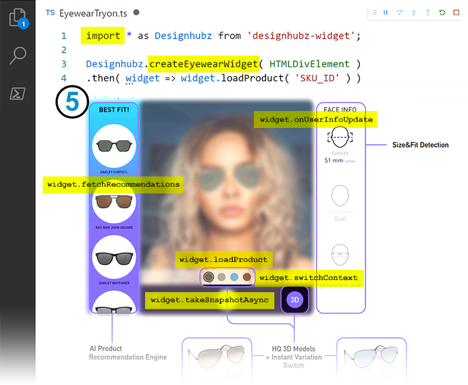

# Companion doc for the eyewear demo



<br>

## Overview
The widget `designhubz-widget` is a very lightweight JS/TS npm package.

It's a simple API that adds a Computer Vision based Realtime 3D Try-On experience, interacting with your digitized inventory on Designhubz' platform and providing 1 of a kind user-feature-based recommendations.


## Maintenance
- We use SemVer (Minor and patch version changes are non-breaking)
- The upgrade is under your control: version bump of `designhubz-widget`, which always has an explicit version
- New releases will include bug fixes or new features to the widget
- Improvements to the 3D/Try-On experiences are *transparent changes* (You won't need to upgrade).


## Adding the widget to your project
1. Refer to [./package.json](./package.json) for the latest version of `designhubz-widget` and add it as a dependencies.
2. `npm install`


## Using the widget
Below is a step by step description of the code in ( [./src/eyewear.ts](./src/eyewear.ts) ).

In this demo, we:

<br>

> SETUP

<br>


1. Create a **Designhubz** namespace
    ``` TS
    import * as Designhubz from 'designhubz-widget';
    ```

<br>

2. Get a reference to our **styled dom element**
    ``` TS
    const container = document.getElementById('designhubz-widget-container') as HTMLDivElement;
    ```

<br>

3. **Optionally**, we chose to **handle camera permissions ourselves** with `demo_videoAuth()` [^camera]

<br>

4. We're on **localhost** and we'll need to **circumvent domain-based whitelisting** [^localhost]

<br>

> LOAD

<br>

5. We **instantiate a `Designhubz.IMultiWidget`**, the compound widget that has 2 modes: 3D and Try-On
    - We'll pass to it our styled dom element, the widget will create an **iframe** that fits this space
    - With an optional progress handler
    - We'll await it to load
    ``` TS
    await Designhubz.createEyewearWidget(container, demo_progressHandler('Eyewear widget'));
    ```

<br>

6. The widget has loaded, the first thing we'll do is **pair this session with analytics**
    ``` TS
    widget.setUserId('ANALYTICS_USER_ID')
    ```
    - Providing this pairing unlocks additional business insights and the impact of XR on your business.

<br>

7. We'll **load our product**
    - Target your XR inventory items with the ID you have provided for integration.
    ``` TS
    await widget.loadProduct('UNIQUE_DIGITIZATION_ID');
    ```
    - Any number of your eyewear products can be loaded in this same widget.
    - Our ecosystem optimizes so that variations of the same product (colors, etc.) will be lightning fast to load!

<br>

> INTERACT
>
> - The widget defaults to 3D view, a better 'waiting area' until the tryon engine has fully loaded (seconds).
> - We recommend letting the user click to switch on Try-On mode after the 3D view: It's a softer intro.

<br>

8. We switch from **3D to Try-On**
    - With an optional progress handler (loading Try-On engine)
    ``` TS
    await widget.switchContext('tryon', demo_progressHandler('Switching to tryon'));
    ```

<br>

9. We setup handlers for **`onUserInfoUpdate` event**
    - Dispatched each time user is analysed (typically once at the start of a session)
    - Usage (check `demo_onUserInfoUpdate` [in ./src/snippets.ts](./src/snippets.ts))

<br>

10. We setup handlers for a **snapshot CTA**
    ``` TS
    const snapshot = await widget.takeSnapshotAsync();
    ```
    - The returned object contains bitmap data, with conversion utilities:
        - https://d2v6wmk4yqo2ys.cloudfront.net/master/docs/latest/interfaces/ISnapshot.html
        ``` TS
        const image = snapshot.createImageElement();
        const dataURL = snapshot.getDataURL('jpeg', 80);
        const blob = await snapshot.getBlobAsync('jpeg', 80);
        ```

<br>

11. We setup handlers for **`trackingHandler` event**
    - When the state changes, due to load or changing widget states: an event with `TrackingStatus` is dispatched
        ``` TS
        enum TrackingStatus { Idle, CameraNotFound, FaceNotFound, Analyzing, Tracking }
        ```
    - Usage (check `demo_trackingHandler` [in ./src/snippets.ts](./src/snippets.ts))

<br>

12. We requested 5 **recommendations**
    - Designhubz' recommendations are user-feature-based and are available after initiating Try-On mode
    - The below resolves to a sorted array of [IScoredRecommendation](https://d2v6wmk4yqo2ys.cloudfront.net/master/docs/latest/interfaces/IScoredRecommendation.html)
    ``` TS
    const recommendations = await widget.fetchRecommendations(5);
    ```

<br>

13. Any number of your eyewear products can be loaded in this same widget, so we **cycle variations automatically.**
    - This is a use-case of the above `loadProduct` and `userInfo`
    - Example: `demo_cycleProducts` [in ./src/snippets.ts](./src/snippets.ts))

<br>

14. Should you ever want to **get rid of the widget** mid-session, call `await widget.disposeAsync()`
    - This will free ram and gpu resources
    - The widget's dom element can be removed


## API Reference

- Designhubz: https://d2v6wmk4yqo2ys.cloudfront.net/master/docs/latest/modules.html
- Intersesting modules:
    - [Eyewear](https://d2v6wmk4yqo2ys.cloudfront.net/master/docs/latest/modules/Eyewear.html)
    - [IMultiWidget](https://d2v6wmk4yqo2ys.cloudfront.net/master/docs/latest/interfaces/IMultiWidget.html)
    - [ISnapshot](https://d2v6wmk4yqo2ys.cloudfront.net/master/docs/latest/interfaces/ISnapshot.html)
    - [TrackingStatus](https://d2v6wmk4yqo2ys.cloudfront.net/master/docs/latest/enums/TrackingStatus.html)


### Notes

[^camera]: Optionally, we chose to handle camera permissions ourselves (check `demo_videoAuth()` [in ./src/snippets.ts](./src/snippets.ts))
    - We might want to use this to set some coockies.
    - If we omit it, the permissions will be handled as part of the regular flow when needed by the XR widget.

[^localhost]: We're on localhost and we'll need to circumvent domain-based whitelisting
    - When deployed, your XR inventory is accessible by resolving a whitelisted domain.
    - On localhost, you'll need to set your company/account's "auth config pair" (reach out to your tech contact for those details)
