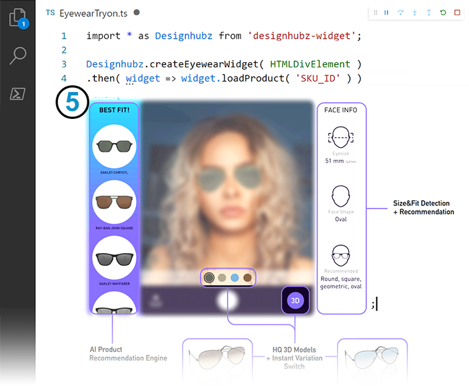

At **Designhubz** we empower brands around the world to connect with shoppers in a complete immersive way.

We’re transforming the online shopping experience with next generation eCommerce interfaces using our leading AR technology that’s being adopted by some of the largest brands and retailers globally.

---

# Designhubz | XR Widget SDK

The widget `designhubz-widget` is a very lightweight JS/TS npm package.

It's a simple API that enable XR and Computer Vision based Realtime 3D Try-On experiences, interacting with your digitized inventory on Designhubz' platform and providing 1 of a kind user-feature-based recommendations ([Our demo showroom uses the widget](https://eyewear.designhubz.com/)).

<br>

In it's simplest form....




## Integration companion guide for Eyewear VTO

https://github.com/designhubz/tryon-widget-example/blob/master/EYEWEAR.md

### Other widgets
The [CCL VTO](./src/ccl.ts), [Spatial XR](./src/spatialXR.ts), and [makeup VTO](./src/makeup.ts) widgets follow a similar recipe.


## API Reference

https://d2v6wmk4yqo2ys.cloudfront.net/master/docs/3.5.0/modules.html

---

## Running the example
1. Clone project and open terminal in root project folder
2. Install and run:
  ```bash
  npm i
  npm start
  ```
3. Have your organisation id and digitized product ids available to configure:
  - (as query param, or directly in the code)
4. Navigate to the local webapp: https://localhost:4200/?demo=eyewear (other widgets: demo=ccl|spatialxr|makeup)

### Adding the widget to your project
Refer to [./package.json](./package.json) for the latest version of `designhubz-widget` and add it as a dependency.

---

## Changelog

### 4.0.0
*(Major eyewear VTO upgrade)*
- Quicker widget loading
- Optimized Tryon setup responsiveness
- Introducing "progressive textures loading"
- Reduced REST API calls
- Improved 3D pipeline optimizations and loading behaviour
- Introduces a more accurate `loadVariation` replacing `loadProduct`

### 3.5.5
- Improve Eyewear widget default mode handling

### 3.5.4
- Introducing SpatialXR dimensions display

### 3.5.3
- Introducing profiler / collect time measurements

### 3.5.2
- Adding post/update session when widget is visible mechanism

### 3.5.1
- Fix referer parameter naming (referrer -> referer)

### 3.5.0
- Fix Container/iframe handshake ("infinite console errors" bug fix)
- Bubble `IMultiWidget.switchContext` errors
- Camera error handling examples, check "[Custom camera handler]" in [./src/eyewear.ts](./src/eyewear.ts) and [./src/ccl.ts](./src/ccl.ts)

### 3.4.2
- Fix `onTrackingScoreChange` event

### 3.4.1
- Bubble up camera errors

### 3.4.0
- CCL VTO 1.0 release
- Adds blending from real ccl textures
- Improved iris tracking quality
- Separate `enableVTOTests` from `configure`
- Adds `onTrackingScoreChange` event and setter `setUITrackingWarnings`

### 3.3.3
- Configuration toggle

### 3.3.2
- Deprecate/remove _dev

### 3.3.0
- CCL VTO beta release

### 3.2.5
- Add auto visibility track handler
- Remove deprecated `OrgId` from `CreateSession`

### 3.2.4
- Track time in AR for Spatial XR

### 3.2.3
- Introduces digitization requirements viz to spatialxr widget with `toggleRequirementsDisplay`

### 3.2.2
- Add `OrgId` to `CreateSession`

### 3.2.1
- Add `IVariation.status` of type `PlatformStatus:  'TODO' | 'INPROGRESS' | 'INREVIEW' | 'DECLINED' | 'APPROVED'`

### 2.2.0
- Upgrade VTO configuration

### 2.1.1
- Improve SpatialXR widget

### 2.0.3
- Bug fixes

### 2.0.2
- Add SpatialXR (room-based AR) widget

### 1.3.2
- Separated dev helpers `Designhubz.auth(ORGANIZATION_ID)` & `Designhubz.setDeployment('staging')`
- Minor improvements

### 1.2.1

- Patched `Designhubz.auth(ORGANIZATION_ID, [TARGET_DEPLOYMENT='staging'])` to target staging deployment (while using staging's organization Id)

### 1.2.0

- Transparent changes that reflects improvements to infrastructure
- Additional "privacy" layer to your products: When developping locally only, calling `Designhubz.auth(ORGANIZATION_ID)` is required to successfully use the widget. When live (not localhost), this is not needed as whitelisting takes over (usage is shown in example).
- Enforcing `widget.setUserId('USER_ID');` right after instanciating the widget.
- Changes SDK deployement path (Please check package.json)

### 1.1.3

- Improved error handling and QA utils
- Bug fixes

### 1.1.2

**Makeup:**
- Improved tracking quality
- Improved overall visual quality 
- Add comparison feature: compare with & without makeup product
- Bug fixes

### 1.1.1

- Unified eyewear and makeup tryon widgets to single SDK.
